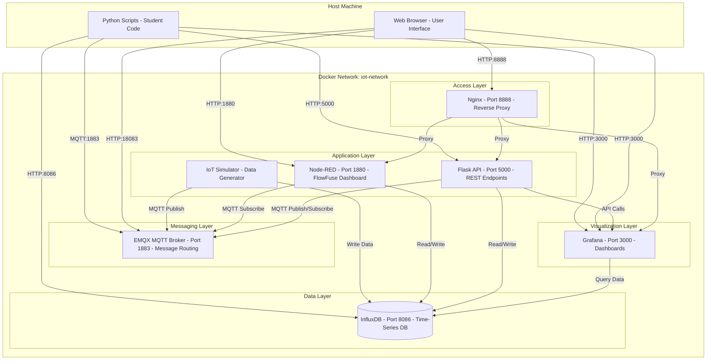
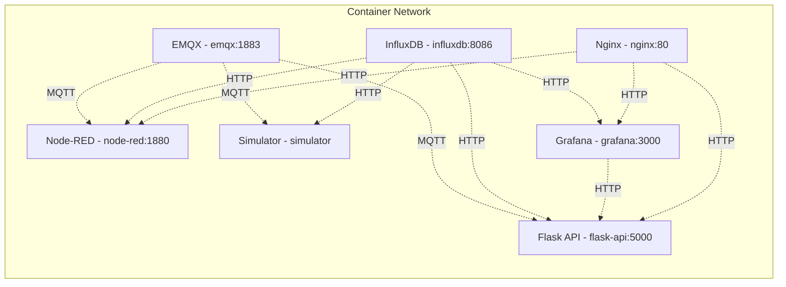
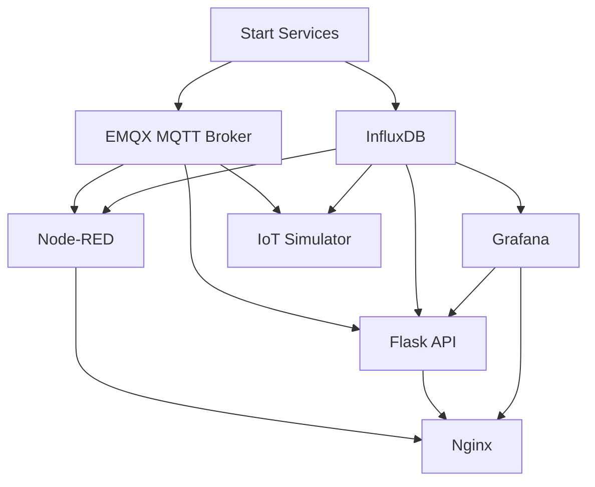
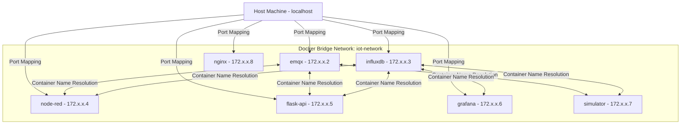
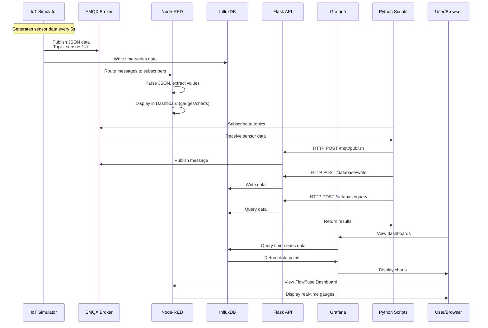
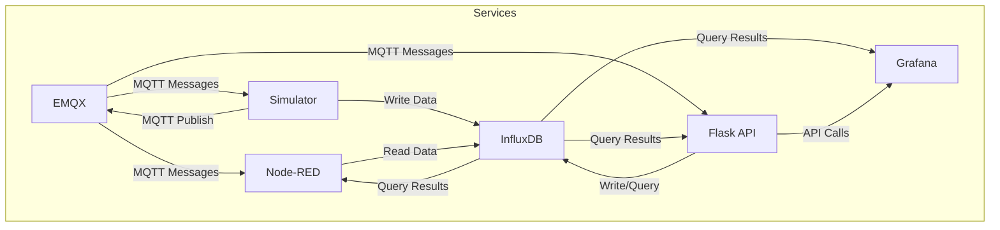
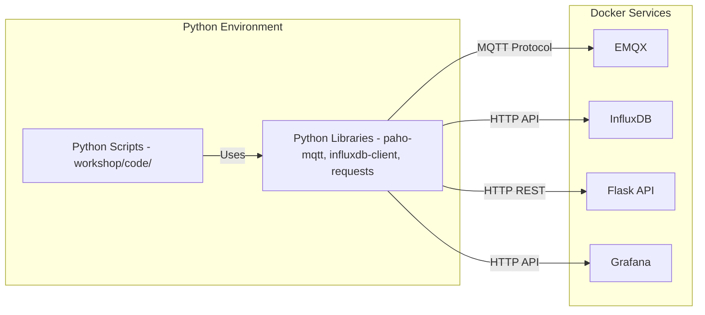
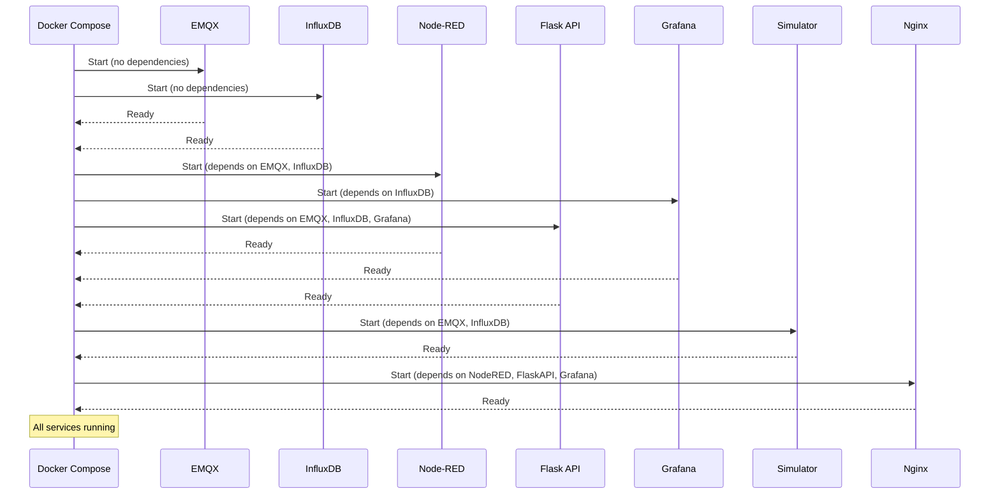
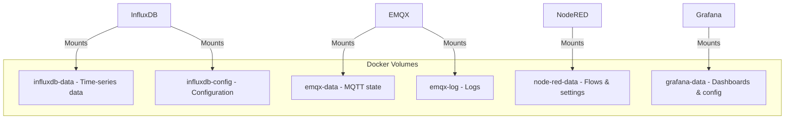

# System Architecture Overview

This document provides a comprehensive overview of the IoT Home Automation Learning Platform architecture, explaining how all Docker services and Python code work together.

## Table of Contents

1. [System Overview](#system-overview)
2. [Architecture Diagram](#architecture-diagram)
3. [Docker Services](#docker-services)
4. [Network Architecture](#network-architecture)
5. [Data Flow](#data-flow)
6. [Component Interactions](#component-interactions)
7. [Python Integration](#python-integration)

## System Overview

The platform is a complete IoT ecosystem designed for teaching Python programming with real-world IoT services. It consists of:

- **7 Docker Services**: Running in isolated containers
- **Python Code**: Student scripts that interact with services
- **Workshop Materials**: 10 progressive learning modules

### Key Components

| Component | Type | Purpose |
|-----------|------|---------|
| EMQX | MQTT Broker | Message routing for IoT devices |
| InfluxDB | Database | Time-series data storage |
| Node-RED | Flow Engine | Visual automation and dashboards |
| Flask API | REST Service | HTTP API for Python interactions |
| Grafana | Visualization | Advanced data visualization |
| Nginx | Reverse Proxy | Unified access point |
| IoT Simulator | Data Generator | Simulates IoT devices |

## Architecture Diagram



## Docker Services

### Service Details



### Service Ports and Access

| Service | Container Name | Internal Port | External Port | Access Method |
|---------|---------------|--------------|---------------|---------------|
| **EMQX** | `iot-emqx` | 1883 | 1883 | MQTT Protocol |
| **EMQX** | `iot-emqx` | 18083 | 18083 | HTTP Dashboard |
| **InfluxDB** | `iot-influxdb` | 8086 | 8086 | HTTP API |
| **Node-RED** | `iot-node-red` | 1880 | 1880 | HTTP UI |
| **Flask API** | `iot-flask-api` | 5000 | 5000 | HTTP REST |
| **Grafana** | `iot-grafana` | 3000 | 3000 | HTTP UI |
| **Nginx** | `iot-nginx` | 80 | 8888 | HTTP Proxy |
| **Simulator** | `iot-simulator` | - | - | Internal Only |

### Service Dependencies



**Dependency Order:**
1. **Base Services**: EMQX, InfluxDB (no dependencies)
2. **Application Services**: Node-RED, Flask API, Grafana (depend on base)
3. **Data Generator**: Simulator (depends on EMQX, InfluxDB)
4. **Access Layer**: Nginx (depends on application services)

## Network Architecture

### Docker Network Configuration

All services run on a single Docker bridge network: `iot-network`



### Connection Methods

**From Host Machine (Python Scripts):**
- Use `localhost` or `127.0.0.1`
- Access via mapped ports (1883, 5000, 8086, etc.)

**From Docker Containers:**
- Use container names (e.g., `emqx`, `influxdb`)
- Access via internal ports (1883, 8086, etc.)
- DNS resolution handled by Docker

## Data Flow

### Complete Data Flow Diagram



### Data Flow Paths

#### Path 1: Simulator → MQTT → Node-RED Dashboard

```
IoT Simulator
  ↓ (Publish MQTT)
EMQX Broker (sensors/temperature/temp-001)
  ↓ (Route to subscribers)
Node-RED MQTT Subscriber
  ↓ (Parse JSON)
Function Node (Extract value)
  ↓ (Route by type)
UI Gauge/Chart
  ↓ (Display)
User Browser (http://localhost:1880/ui)
```

#### Path 2: Python Script → Flask API → InfluxDB

```
Python Script
  ↓ (HTTP POST)
Flask API (/database/write)
  ↓ (InfluxDB Client)
InfluxDB (Store data point)
  ↓ (Query)
Grafana Dashboard
  ↓ (Display)
User Browser (http://localhost:3000)
```

#### Path 3: Python Script → MQTT → Multiple Subscribers

```
Python Script
  ↓ (Publish MQTT)
EMQX Broker
  ↓ (Broadcast)
  ├─→ Node-RED (Subscriber)
  ├─→ Flask API (Subscriber)
  └─→ Other Python Scripts (Subscribers)
```

## Component Interactions

### Interaction Matrix



### Detailed Interactions

#### 1. MQTT Communication

**Protocol**: MQTT (Message Queuing Telemetry Transport)
**Port**: 1883 (internal), 1883 (external)

**Publishers:**
- IoT Simulator: Publishes sensor data
- Python Scripts: Publish commands/data
- Flask API: Publishes via `/mqtt/publish` endpoint
- Node-RED: Can publish via flows

**Subscribers:**
- Node-RED: Subscribes to `sensors/+/+`
- Python Scripts: Subscribe to topics
- Flask API: Can subscribe for processing

#### 2. Database Operations

**Protocol**: HTTP REST API
**Port**: 8086

**Writers:**
- IoT Simulator: Writes sensor readings
- Flask API: Writes via `/database/write` endpoint
- Python Scripts: Write directly using `influxdb-client`

**Readers:**
- Grafana: Queries for visualization
- Flask API: Queries via `/database/query` endpoint
- Python Scripts: Query directly
- Node-RED: Can query via InfluxDB nodes

#### 3. REST API Communication

**Protocol**: HTTP REST
**Port**: 5000

**Endpoints:**
- `/mqtt/publish` - Publish MQTT messages
- `/mqtt/subscribe` - Subscribe to topics
- `/database/write` - Write to InfluxDB
- `/database/query` - Query InfluxDB
- `/devices/*` - Device management

**Clients:**
- Python Scripts: Use `requests` library
- Web Browsers: Direct HTTP calls
- Other Services: Internal API calls

## Python Integration

### How Python Code Interacts with Services



### Python Library Usage

| Library | Service | Purpose | Example |
|---------|---------|---------|---------|
| `paho-mqtt` | EMQX | MQTT communication | Publish/subscribe messages |
| `influxdb-client` | InfluxDB | Database operations | Write/query time-series data |
| `requests` | Flask API, Grafana | HTTP communication | REST API calls, Grafana API |
| `python-dotenv` | All | Configuration | Load environment variables |

### Connection Patterns

#### Pattern 1: Direct Service Connection

```python
# Direct connection to services
import paho.mqtt.client as mqtt
from influxdb_client import InfluxDBClient

# Connect to MQTT (from host machine)
mqtt_client = mqtt.Client()
mqtt_client.connect("localhost", 1883, 60)  # Use localhost

# Connect to InfluxDB (from host machine)
influx_client = InfluxDBClient(
    url="http://localhost:8086",  # Use localhost
    token="my-token",
    org="iot-org"
)
```

#### Pattern 2: Via REST API

```python
# Connect via Flask API
import requests

# Publish MQTT via API
response = requests.post(
    "http://localhost:5000/mqtt/publish",
    json={"topic": "sensors/data", "message": {...}}
)

# Query database via API
response = requests.post(
    "http://localhost:5000/database/query",
    json={"query": "from(bucket: \"iot-data\")..."}
)
```

## Service Startup Sequence



## Data Persistence

### Volumes



**Volume Locations:**
- Data persists across container restarts
- Volumes managed by Docker
- Can be backed up/restored

## Security Considerations

### Network Isolation

- All services on isolated Docker network
- Only necessary ports exposed to host
- Internal communication via container names

### Authentication

- **InfluxDB**: Token-based authentication
- **Grafana**: Username/password (admin/admin)
- **EMQX**: Default credentials (admin/public)
- **Flask API**: No authentication (development mode)

**Note**: For production, implement proper authentication!

## Performance Characteristics

### Resource Usage

- **Lightweight Services**: EMQX, Nginx
- **Medium Services**: Node-RED, Flask API
- **Heavy Services**: InfluxDB, Grafana

### Scalability

- Services can be scaled horizontally
- Load balancing via Nginx
- Database sharding possible
- MQTT clustering supported
